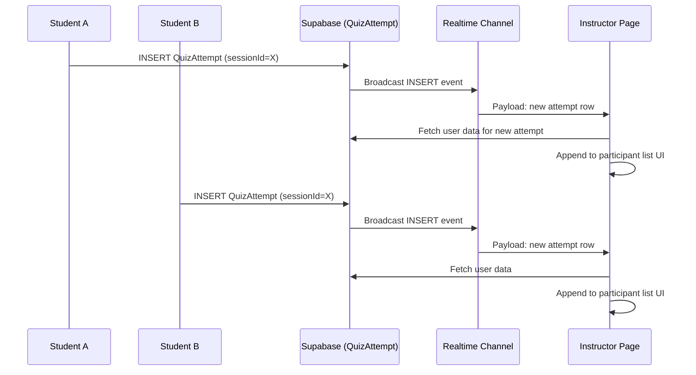

# Realtime Architecture — Live Quiz Feature

## Overview

Supabase Realtime (WebSocket-based) is used to push live updates to the instructor and student pages during a live quiz session. This enables participants to appear instantly without polling.

---

## Setup Required

### 1. Add Environment Variables

```env
NEXT_PUBLIC_SUPABASE_URL=https://ckslaypgpinfliigkjxw.supabase.co
NEXT_PUBLIC_SUPABASE_ANON_KEY=<your-anon-key>
```

### 2. Enable Realtime on Supabase

In the Supabase Dashboard:

1. Go to **Database → Replication**
2. Under **Realtime**, enable the `QuizAttempt` table
3. Set the replication mode to **"Enable Realtime for this table"**

This allows the frontend to subscribe to INSERT/UPDATE/DELETE events on `QuizAttempt`.

---

## Files Created / Modified

### `lib/supabase.ts` (new)
Creates a Supabase client instance using `NEXT_PUBLIC_SUPABASE_URL` and `NEXT_PUBLIC_SUPABASE_ANON_KEY`. Used only on the client side for Realtime subscriptions.

### `hooks/useRealtimeSession.ts` (new)
React hook that:
- Fetches initial participant list from `QuizAttempt` table
- Subscribes to `INSERT` events on `QuizAttempt` filtered by `sessionId`
- When a new participant joins, fetches their user data and appends to the list
- Returns `{ participants, status }`
- Cleans up the subscription on unmount

### `app/(pages)/instructor/quizzes/live/[id]/QuizLiveSessionPage.tsx` (modified)
- Imports `useRealtimeParticipants(sessionId)` hook
- Merges realtime updates with initial server data
- Participant count and list update live as students join

### `app/(pages)/student/quizzes/live/[id]/StudentLiveSession.tsx` (modified)
- Imports `useRealtimeParticipants(sessionId)` hook
- Participant count badge updates in realtime as other students join

---

## How It Works



---

## Tables Requiring Replication

| Table | Events | Purpose |
|-------|--------|---------|
| `QuizAttempt` | INSERT | Detect new participants joining |
| `LiveSession` | UPDATE | Detect session start/end state changes |

Future: `QuizAttempt` UPDATE for score changes, `LiveSession` UPDATE for current question index.

---

## Polling Fallback

As a reliability measure, the student page also polls the `LiveSession` table every 3 seconds. If the session is cancelled, the page reloads to pick up the new state. This ensures the student sees the cancellation even if the Realtime `UPDATE` event is delayed or dropped.

---

## Limitations

- **Client-side only**: Subscriptions are created in `"use client"` components. Server components cannot subscribe.
- **Supabase Realtime must be enabled** per table in the dashboard — no code change needed there.
- **No auth integration**: The Realtime channel is unauthenticated (public anon key). All participants see the same data. This is acceptable for a quiz session where participants just need to know the count.
